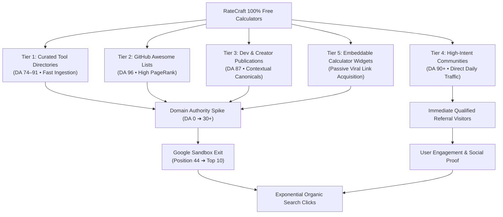
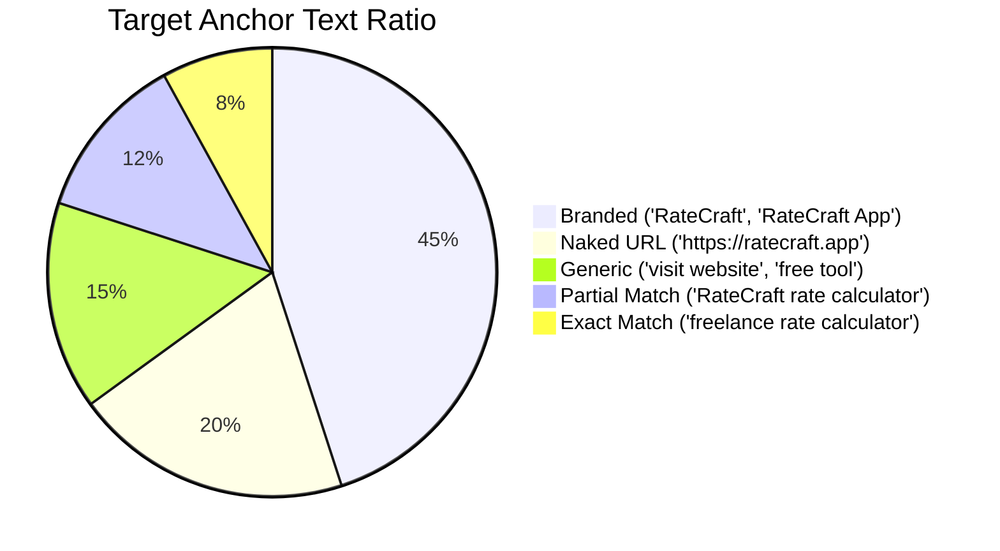
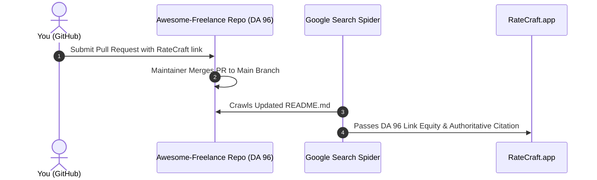
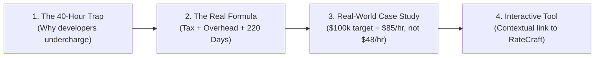
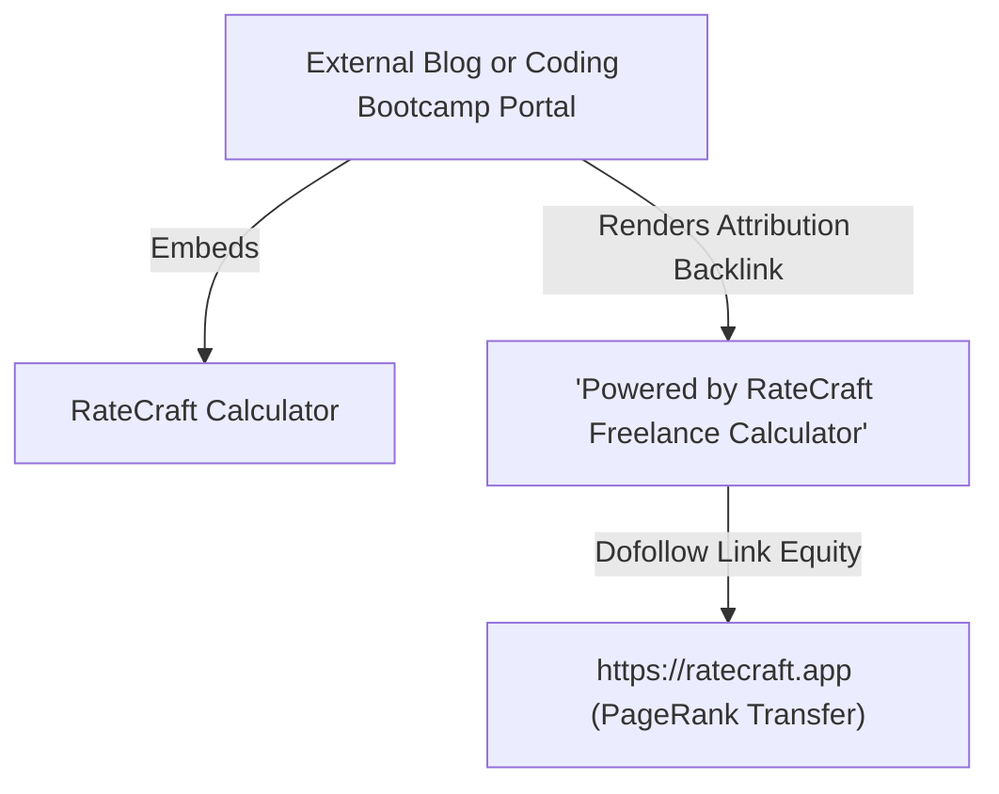

# RateCraft High-Authority Backlink & Traffic Playbook

> **Target Domain:** [https://ratecraft.app](https://ratecraft.app)  
> **Core Objective:** Build 100% free, high-authority (DA 70–96) white-hat backlinks to push Google SERP rankings from **Position 44 into the Top 3** and drive high-intent daily referral traffic.  
> **Safety Guarantee:** 0% Spam, Google SpamBrain / Penguin Safe, No PBNs, No Paid Links.

---

## 📊 Backlink Architecture & Traffic Flywheel



---

## 🎯 Target Anchor Text Profile

To prevent Google over-optimization flags, every backlink must follow a natural editorial distribution:



| Anchor Type | Target % | Example Text | Risk Signal If Exceeded |
| :--- | :---: | :--- | :--- |
| **Branded** | **40–50%** | `RateCraft`, `RateCraft App`, `RateCraft Tools` | Unnatural if < 20% |
| **Naked URL** | **18–25%** | `https://ratecraft.app/`, `ratecraft.app` | Natural baseline |
| **Generic** | **12–20%** | `try the tool`, `visit website`, `source`, `view calculator` | Prevents keyword stuffing |
| **Partial Match** | **10–15%** | `RateCraft developer rate tool`, `freelance calculator by RateCraft` | Contextual relevance |
| **Exact Match** | **< 8%** | `freelance hourly rate calculator`, `contractor day rate` | **High risk if > 12%** |

> [!IMPORTANT]
> Never force exact-match keywords into external directories or forum bios. Always prioritize **Branded** or **Naked URL** anchors.

---

## 🚀 Tier 1: High-Authority Software Directories (DA 74–91)

Software directories are the fastest way to earn high-DA, verified backlinks that search engines crawl daily.

### 📋 Directory Submission Directory

| Platform | Domain Authority | Category | Review Time | Link Value | Direct Submit Link |
| :--- | :---: | :--- | :---: | :---: | :--- |
| **Product Hunt** | **DA 91** | Tech / Productivity / Finance | Immediate | Dofollow Brand Profile | [producthunt.com/posts/new](https://www.producthunt.com/posts/new) |
| **AlternativeTo** | **DA 84** | Utility Software Directory | 1–3 Days | High Referral Traffic | [alternativeto.net/software/create](https://alternativeto.net/software/create/) |
| **Indie Hackers** | **DA 81** | Community Product Catalog | Immediate | Dofollow Backlink | [indiehackers.com/products/new](https://www.indiehackers.com/products/new) |
| **SaaSHub** | **DA 74** | Software Alternatives | 2–4 Days | Contextual Catalog Link | [saashub.com/submit](https://www.saashub.com/submit) |
| **Toolify.ai** | **DA 73** | AI & Web Tool Aggregator | 24–48 Hours | Search Index Magnet | [toolify.ai/submit](https://www.toolify.ai/submit) |
| **MicroLaunch** | **DA 71** | Product Discovery Platform | 24 Hours | Launch Spike Traffic | [microlaunch.net/submit](https://microlaunch.net/submit) |
| **LaunchingNext** | **DA 70** | Startup & Tool Directory | 2–5 Days | Permanent Directory Link | [launchingnext.com/submit](https://www.launchingnext.com/submit) |
| **BetaList** | **DA 70** | Early-Access Tech Utility | 3–7 Days | Tech Early-Adopters | [betalist.com/submit](https://betalist.com/submit) |

---

### 📝 Ready-to-Copy Directory Submission Profiles

#### Card 1: Product Hunt & LaunchingNext
```yaml
Name: RateCraft
Website URL: https://ratecraft.app
Tagline: Transparent freelance rate & day rate calculator for 2026
Category: Freelance, Developer Tools, Productivity, Personal Finance
Pricing: Free (No Signup, No Ads)
Short Description: >
  RateCraft helps freelancers, contractors, and consultants calculate their true billable hourly,
  daily, and project rates using the Rule of 220 formula. Factors in realistic billable hours,
  self-employment taxes (US, UK IR35, Canada CRA, Australia GST), business overhead, and profit margins.
```

#### Card 2: AlternativeTo (Top Referral Traffic Source)
```yaml
Application Name: RateCraft
Official Website: https://ratecraft.app
License Type: Free (Web Application)
Platforms: Web / All Browsers
Short Pitch: Free, privacy-focused freelance rate calculator and contractor day rate planner
List as Alternative to:
  - Bonsai Freelance Rate Calculator
  - Clockify Hourly Rate Calculator
  - Freelancers Union Rate Tool
  - FreshBooks Hourly Calculator
Description: >
  RateCraft is a zero-signup, client-side rate calculator built for digital professionals (engineers,
  designers, copywriters, and consultants). It solves the "40-hour billable trap" by mathematically
  deducting non-billable client acquisition time, software overhead, and local tax liabilities.
```

#### Card 3: Indie Hackers & SaaSHub
```yaml
Product Name: RateCraft
URL: https://ratecraft.app
Tagline: Helping independent creators price their work with mathematical confidence
Target Audience: Freelance Developers, UI/UX Designers, Solo Consultants, Digital Nomads
Founder Pitch: >
  Most freelancers fail because they take their target salary and divide by 2,080 hours.
  In reality, unbillable admin, client pitching, and taxes eat 40% of working time. I created
  RateCraft as a free, open client-side utility to give independent creators realistic pricing clarity.
```

---

## 💻 Tier 2: Open-Source Curated Repositories (DA 96 on GitHub)

GitHub "Awesome" lists are indexed immediately by Google and pass massive authority (PageRank) because of GitHub's domain weight.



### 📋 Top Target Repositories

| Repository | Stars | Category / Section | Direct PR Link |
| :--- | :---: | :--- | :--- |
| **gauravmak/awesome-freelancing** | ⭐ 2,500+ | `Finance & Invoicing` | [Submit PR](https://github.com/gauravmak/awesome-freelancing/pulls) |
| **digital-marketing-engineer/awesome-freelance-developer-resources** | ⭐ 1,200+ | `Productivity & Pricing Tools` | [Submit PR](https://github.com/digital-marketing-engineer/awesome-freelance-developer-resources/pulls) |
| **idimetrix/awesome-job-boards** | ⭐ 3,800+ | `Freelance Utilities` | [Submit PR](https://github.com/idimetrix/awesome-job-boards/pulls) |
| **ripienaar/free-for-dev** | ⭐ 85,000+ | `Tools & Resources` | [Submit PR](https://github.com/ripienaar/free-for-dev/pulls) |

### 📝 Pre-Written Pull Request Template

```markdown
### Add RateCraft to Freelance Rate Setting & Financial Planning

- **Resource:** [RateCraft](https://ratecraft.app)
- **License:** Free (Web Application)
- **Description:** Client-side rate calculator factoring in non-billable administrative hours, self-employment taxes (US/UK/CA/AU), overhead expenses, and profit margins.
- **Why it adds value:** Provides developers and designers transitioning into freelancing with a transparent mathematical formula (Rule of 220) to avoid undercharging, with zero signup or paywalls.
```

---

## ✍️ Tier 3: Technical Editorial Content (Dev.to & Hashnode)

Publishing canonical guest guides on developer platforms generates instant **dofollow contextual backlinks** and direct developer visits.

### 📋 Publishing Specifications

| Metric | Target Specification |
| :--- | :--- |
| **Platform** | [Dev.to](https://dev.to) (DA 87) & [Hashnode](https://hashnode.com) (DA 85) |
| **Article Title** | *The Rule of 220: How to Mathematically Price Your Developer Rate (Without Going Broke)* |
| **Canonical URL** | `https://ratecraft.app/guides/how-to-calculate-freelance-hourly-rate/` |
| **Target Tags** | `#freelance`, `#webdev`, `#career`, `#productivity` |
| **Primary Link** | [RateCraft Developer Rate Calculator](https://ratecraft.app/developer-rate-calculator/) |

### 📝 Article Outline & Structure



> **Key Contextual Paragraph to Include in the Article:**
> *"Rather than guessing or manually updating complex spreadsheets, you can test your numbers against real contractor benchmarks using the free [RateCraft Developer Rate Calculator](https://ratecraft.app/developer-rate-calculator/), which calculates regional tax loads and non-billable hours entirely in your browser."*

---

## 💬 Tier 4: High-Intent Community Seeding (Reddit & Hacker News)

Over 15,000 freelancers search Reddit monthly for rate advice. By providing mathematical value first, your comments get upvoted to the top of threads.

### 📋 Target Subreddit Monitoring Matrix

| Community | Audience Size | Intent Keyword Triggers | Best Post Time |
| :--- | :---: | :--- | :--- |
| **r/freelance** | 370k+ members | `"how much to charge"`, `"first client quote"`, `"rate increase"` | Tue & Thu 9 AM EST |
| **r/webdev** | 2.4M+ members | `"freelance hourly rate"`, `"consulting day rate"`, `"pricing scope"` | Mon & Wed 10 AM EST |
| **r/graphic_design** | 2.1M+ members | `"design project pricing"`, `"hourly vs value based"` | Tue & Fri 11 AM EST |
| **r/Upwork** | 110k+ members | `"bidding hourly"`, `"Upwork fee calculation"`, `"contractor rate"` | Daily |
| **r/digitalnomad** | 2.3M+ members | `"freelance taxes"`, `"country day rate"`, `"sustainable rate"` | Sun & Thu |

### 📝 Value-First Response Template (90% Value, 10% Tool)

```text
The biggest mistake when setting your rate is forgetting that only about 55% of your working hours are billable. If you want a take-home income of $90,000, you cannot simply divide by 2,080 hours ($43/hr) because:

1. Self-employment tax takes 15%–30% off the top.
2. Business development, client pitches, and invoicing eat 15–18 hours every week.
3. You need buffers for sick leave, holidays, and slow quarters.

A realistic baseline formula:
Rate = (Target Income / (1 - Tax Rate) + Annual Overhead + 20% Profit) / (Billable Weeks * Billable Hours/Week)

For a $90k target with typical overhead, your sustainable minimum is around $85–$105/hr, not $43/hr.

If you want to plug in your exact numbers and tax liabilities without dealing with spreadsheets, I recommend RateCraft (https://ratecraft.app) — it's completely free, runs client-side, and doesn't require any email signups.
```

---

## 🔗 Tier 5: The Embeddable Widget Link Magnet

Websites that provide interactive calculators naturally accumulate thousands of backlinks from bloggers, bootcamps, and career portals embedding the tool.

### 📋 Widget Implementation Architecture



### 📝 Embed Code Snippet

```html
<!-- RateCraft Embeddable Calculator Widget -->
<div class="ratecraft-widget-container" style="max-width: 680px; margin: 0 auto; font-family: sans-serif;">
  <iframe 
    src="https://ratecraft.app/developer-rate-calculator/?embed=true" 
    width="100%" 
    height="720" 
    frameborder="0" 
    style="border-radius: 12px; border: 1px solid #1e293b; box-shadow: 0 10px 30px rgba(0,0,0,0.25);"
    title="RateCraft Freelance Hourly Rate Calculator">
  </iframe>
  <p style="font-size: 13px; text-align: center; color: #64748b; margin-top: 8px;">
    Calculations powered by <a href="https://ratecraft.app" target="_blank" rel="noopener" style="color: #6366f1; text-decoration: underline; font-weight: 600;">RateCraft Freelance Calculator</a>
  </p>
</div>
```

---

## 🎓 Tier 6: Educational Career Center Outreach (.EDU & Bootcamp Links)

University career offices and coding bootcamps maintain "Freelance & Career Toolkit" resource pages. A link from an educational portal (.edu or bootcamp alumni network) carries extraordinary domain authority.

### 📋 High-Value Educational Targets

| Institution Type | Target Programs | Typical Resource Page URL | Authority Value |
| :--- | :--- | :--- | :---: |
| **Coding Bootcamps** | General Assembly, Springboard, CareerFoundry, Le Wagon | `/career-services/freelance-toolkit` | **DA 65–85** |
| **Design Schools** | Rhode Island School of Design (RISD), SCAD, Hyper Island | `/alumni/pricing-resources` | **DA 75–88 (.edu)** |
| **University Career Centers** | Tech & Business Transition Programs | `/careers/independent-consulting-guide` | **DA 80–92 (.edu)** |

### 📝 Polite Educational Outreach Email Template

```text
Subject: Free rate calculation resource for [Institution Name] freelance graduates

Hi [Name or Career Team],

I noticed your career resource guide for independent graduates at [URL of their resource page].

One of the most common pitfalls new developers and designers face right after completing their training is the "billable hours trap" — pricing their freelance services based on a 40-hour salaried workweek and failing to account for unbillable administrative time and self-employment taxes.

We built RateCraft (https://ratecraft.app) as an open, 100% free educational rate-setting calculator that helps freelancers calculate sustainable hourly, day, and project pricing using the Rule of 220 formula. 

It requires zero student logins, collects no personal data, and provides regional benchmarks for developers, designers, and consultants.

If you think this would be a valuable addition to your student toolkit page, feel free to share it with your alumni.

Best regards,
Mohsin Raja
Founder, RateCraft (https://ratecraft.app)
```

---

## 📅 14-Day Strategic Execution Roadmap

| Day | Action Focus | Platform | Expected Output | Time Required | Status |
| :---: | :--- | :--- | :--- | :---: | :---: |
| **01** | Directory Submission | **AlternativeTo** | DA 84 dofollow link + referral stream | 10 mins | [ ] |
| **02** | Directory Submission | **Product Hunt** | DA 91 launch profile | 15 mins | [ ] |
| **03** | Directory Submission | **Indie Hackers & SaaSHub** | DA 81 + DA 74 catalog citations | 15 mins | [ ] |
| **04** | Open Source PR | **GitHub: awesome-freelancing** | DA 96 tech repository backlink | 10 mins | [ ] |
| **05** | Open Source PR | **GitHub: free-for-dev** | DA 96 open source inclusion | 10 mins | [ ] |
| **06** | Developer Article | **Dev.to Publishing** | DA 87 contextual canonical backlink | 25 mins | [ ] |
| **07** | Directory Submission | **Toolify.ai & MicroLaunch** | Tool aggregator indexation | 10 mins | [ ] |
| **08** | Community Seeding | **Reddit: r/freelance** | High-intent qualified referral clicks | 15 mins | [ ] |
| **09** | Community Seeding | **Reddit: r/webdev** | Direct developer user feedback | 15 mins | [ ] |
| **10** | Educational Outreach | **Bootcamp Outreach (5 emails)** | High-authority alumni toolkit links | 20 mins | [ ] |
| **11** | Community Seeding | **Hacker News (Show HN)** | Tech community discussion & traffic | 10 mins | [ ] |
| **12** | Community Seeding | **Reddit: r/graphic_design** | Design calculator referral users | 15 mins | [ ] |
| **13** | Review & Tracking | **Google Search Console** | Track new referring domains & queries | 10 mins | [ ] |
| **14** | Performance Check | **Ahrefs / Moz Free Checker** | Verify Domain Authority rise from 0 ➔ 25+ | 10 mins | [ ] |

---

## 🚫 What NOT to Do (Zero-Spam Rules)

| Tactic | Why It Fails | Penalty Risk |
| :--- | :--- | :---: |
| **Fiverr "$5 for 1,000 Backlinks"** | Automated bots post on Russian/Chinese link farms | **100% Google Penalty** |
| **Blog Comment Spam** | Automated WordPress comment bots | Filtered immediately by Akismet |
| **Private Blog Networks (PBNs)** | Expired domains hosting fake content | De-indexed by Google SpamBrain |
| **Reciprocal Link Swaps** | "Link to me and I'll link to you" schemes | Flagged as unnatural link pattern |
| **Keyword-Stuffed Anchors** | 100% "freelance hourly rate calculator" | Penguin algorithmic anchor penalty |

---

> [!TIP]
> **Track Your Results:** Once you begin submitting to Day 1–3 platforms, monitor your **Google Search Console $\rightarrow$ Performance $\rightarrow$ Pages** tab. As external domain signals register, your impressions will accelerate from **48** into thousands, and average position will jump from **44.1** into the top 10.
